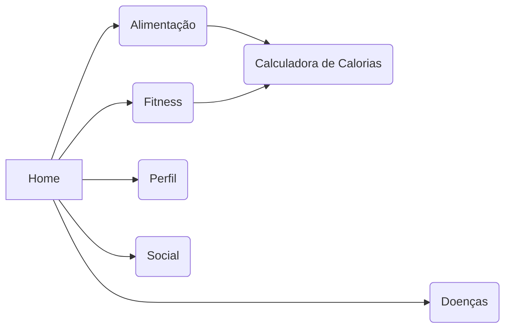

# Trabalho de Conclusão de Curso
Home,
    Doenças,
    Fitness,
    Alimentação,
        Calculadora de cal,
    Perfil,
    Social,

## A fazer
    > **IMPORTANTE** Adicionar Peso,Altura no banco
    > Foto_de_Perfil DEBUG
    > Checagem de Usuario (Existente)
    > Login
    > CRUD
    > Perfil
    > Home
    
> $ git config --global user.email "godlolpro32@gmail.com"
> $ git config --global user.name "JP1005YT"

https://prod.liveshare.vsengsaas.visualstudio.com/join?2BC118B2A0CDF693AC8E93AE8B77813B7880
