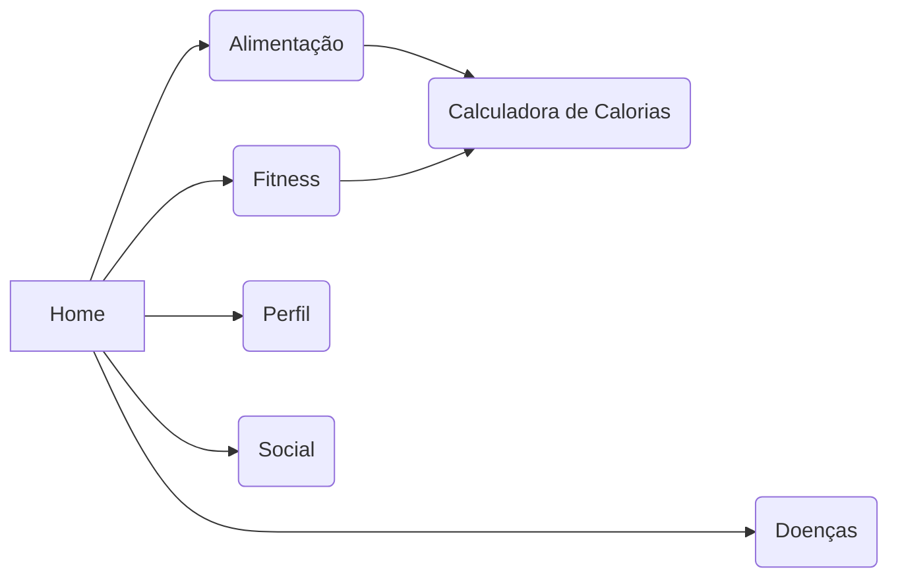

# Trabalho de Conclusão de Curso
Home,
    Doenças,
    Fitness,
    Alimentação,
        Calculadora de cal,
    Perfil,
    Social,

## A fazer
    > **IMPORTANTE** Adicionar Peso,Altura e Foto_de_Perfil no banco
    > Checagem de Usuario (Existente)
    > Encripitar a Senha
    > Login
    > CRUD
    > Perfil
    > Home
